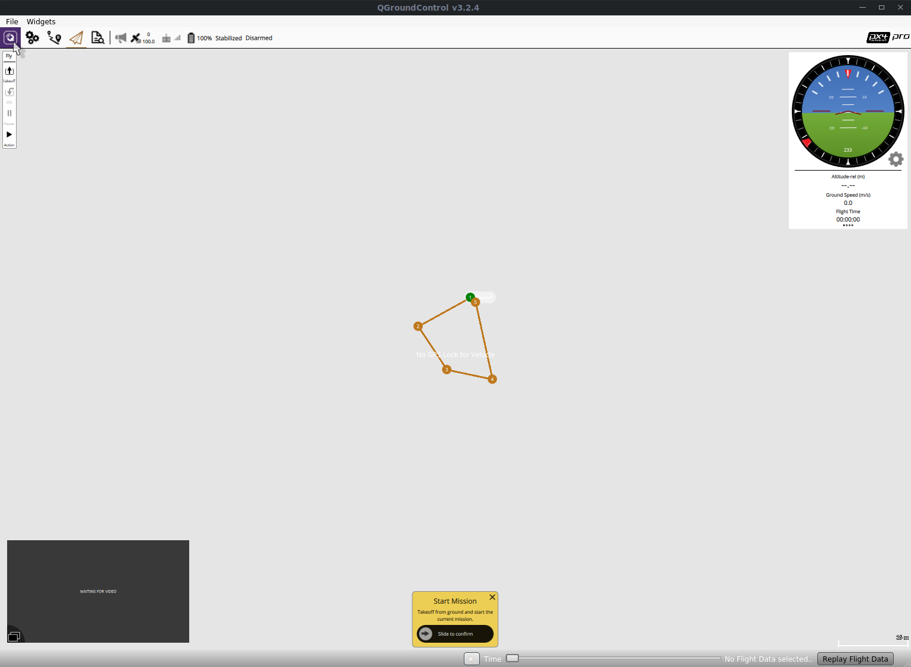
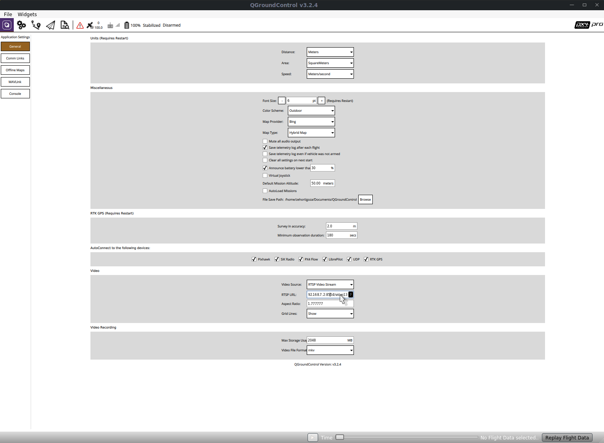
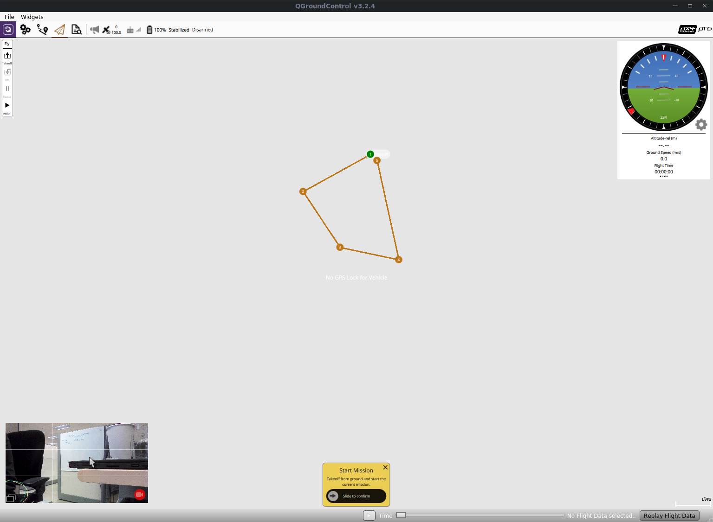

# Camera streaming

Since Intel Aero OS image 1.4, it comes preloaded with
[Camera Streaming Daemon](https://github.com/01org/camera-streaming-daemon/),
that is a daemon to stream available video streams using the RTSP protocol.

## Getting the list of streams

The Camera Streaming Daemon running in Aero is by default publishing all the
streams using zeroconf, so from a Linux host machine with Avahi (Linux
implementation of zeroconf) running you can get the list streams with:
`avahi-browse -a -r -t`

In the output you should have something like:
``` console
= wlp58s0 IPv4 /video13                                      _rtsp._udp           local
   hostname = [intel-aero.local]
   address = [192.168.8.1]
   port = [8554]
   txt = ["name=Intel RealSense 3D Camera R200" "frame_size[0]=YUYV(1920x1080,1280x720,960x540,848x480,640x480,640x360,424x240,320x240,320x180)" "frame_size[1]=pRAA(2400x1081)"]
= wlp58s0 IPv4 /rsdepth                                      _rtsp._udp           local
   hostname = [intel-aero.local]
   address = [192.168.8.1]
   port = [8554]
   txt = ["name=RealSense Depth Camera" "frame_size[0]=NV12(640x480)"]
= wlp58s0 IPv4 /rsir                                         _rtsp._udp           local
   hostname = [intel-aero.local]
   address = [192.168.8.1]
   port = [8554]
   txt = ["name=RealSense Infrared Camera" "frame_size[0]=NV12(640x480)"]
= wlp58s0 IPv4 /rsir2                                        _rtsp._udp           local
   hostname = [intel-aero.local]
   address = [192.168.8.1]
   port = [8554]
   txt = ["name=RealSense Infrared Camera2" "frame_size[0]=NV12(640x480)"]
```

Or you can build the Camera Streaming Daemon samples and just run
`camera-sample-client` on your computer. It gives you a more clean output:

``` console
Service resolved: '/rsir2' (rtsp://192.168.8.1:8554/rsir2)
TXT: ["name=RealSense Infrared Camera2" "frame_size[0]=NV12(640x480)"]
Service resolved: '/rsir' (rtsp://192.168.8.1:8554/rsir)
TXT: ["name=RealSense Infrared Camera" "frame_size[0]=NV12(640x480)"]
Service resolved: '/rsdepth' (rtsp://192.168.8.1:8554/rsdepth)
TXT: ["name=RealSense Depth Camera" "frame_size[0]=NV12(640x480)"]
Service resolved: '/video13' (rtsp://192.168.8.1:8554/video13)
TXT: ["name=Intel RealSense 3D Camera R200" "frame_size[0]=YUYV(1920x1080,1280x720,960x540,848x480,640x480,640x360,424x240,320x240,320x180)" "frame_size[1]=pRAA(2400x1081)"]
```

!!! Note
    The IP address shown in here is the one from Aero WiFi in Access Point
    mode. It will have a different IP if you are connected by other means.

Use one of the URIs discovered above to watch the streams. On The RTF, for
example `/video13` is the RGB stream of the RealSense camera.

## Watching the stream using VLC

`vlc rtsp://192.168.8.1:8554/video13`

!!! Note
    Due to VLC implementation it has a latency of 2 seconds.

## Watching the stream using GStreamer

`gst-launch-1.0 rtspsrc location=rtsp://192.168.8.1:8554/video13 latency=0 ! decodebin ! autovideosink`

!!! Note
    The latency=0 parameter does the trick to reduce the latency to a
    minimum. You can tweak it to your needs to get the best results in terms
    of latency and smooth video.

## Watching the stream using QGroundControl

[QGroundControl](http://qgroundcontrol.com/) still doesn't have support to
autodetect the streams but you can still see the them if you configure it
manually:

[](img/camera/qgc_streaming_step1.png)
[](img/camera/qgc_streaming_step2.png)
[](img/camera/qgc_streaming_step3.png)

## Lowering the stream resolution

When streaming over WiFi on an environment with multiple WiFi networks it can
cause some freezes on the stream. This can be reduced by lowering the
stream resolution. To do that you need to check all the resolutions supported
by the stream and set the resolution desired on the URL like below:

`gst-launch-1.0 rtspsrc location='rtsp://192.168.8.1:8554/video13?width=640&height=480' latency=0 ! decodebin ! autovideosink`

Other alternative is to change to WiFi channels with less congestion.
In client mode it's possible to use the 5GHz band, but it will reduce
the range.
