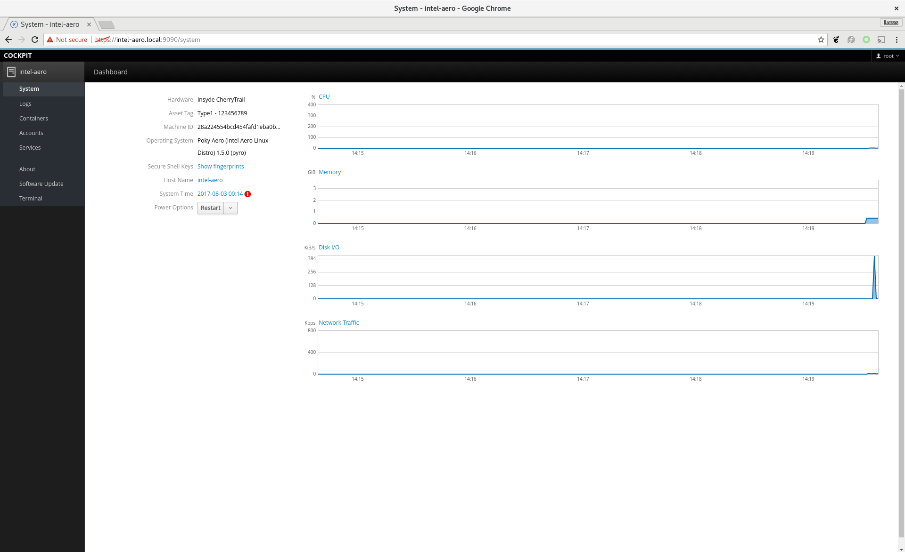
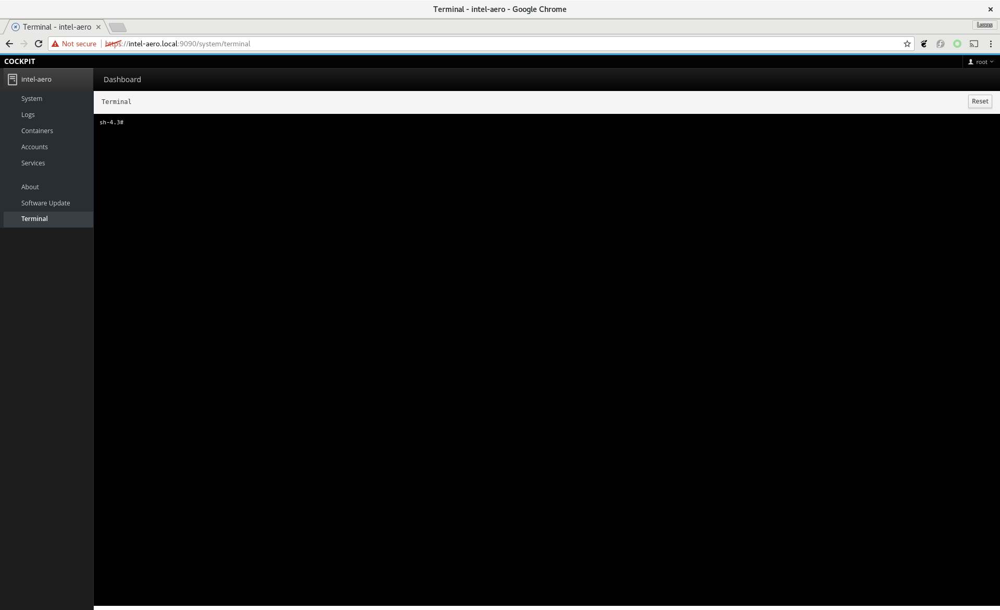

# Connecting to Intel Aero

The Intel Aero board comes pre-configured with 2 network interfaces: WiFi and
ethernet over USB. This section details how to connect to the board using them.

## Methods

### WiFi (Access Point)

By default the OS image configure the WiFi interface as an Access Point with ssid
`Aero-<MAC>`, in which `<MAC>` is the [MAC address](https://en.wikipedia.org/wiki/MAC_address)
of the interface, varying from device to device. It's configured WPA-PSK security
and passkey **1234567890**. After connecting to Aero it's advised to
change the and ssid by using the following commands:

``` console
# nmcli c modify hotspot 802-11-wireless-security.psk <new passkey>
# nmcli c modify hotspot 802-11-wireless.ssid <new ssid>
```

You can also edit the configuration file in
`/etc/NetworkManager/system-connections/Hostspot`. In case you switched the
interface to work in [client mode](#wifi-client) you may get it back in AP mode
with the following commands:


``` console
# nmcli c up hotspot
Connection successfully activated (D-Bus active path: ... 
# nmcli c modify hotspot connection.autoconnect yes
```

### WiFi (Client)

First you need to disable AP mode which is the default one:

``` console
# nmcli c down hotspot
Connection 'hotspot' successfully deactivated (D-Bus active path: ...
# nmcli c modify hotspot connection.autoconnect no
```

Scan WiFi networks with `nmcli dev wifi` command. Example:

``` console
# nmcli dev wifi
   ABCD-C072-5         Infra  157   54 Mbit/s  79      ***   WPA1 WPA2
   MYOFFICEWLAN        Infra  44    54 Mbit/s  75      ***   WPA1 WPA2 802.1X 
   LabWLAN             Infra  44    54 Mbit/s  75      ***   WPA2 802.1X
   AndroidHotspot      Infra  44    54 Mbit/s  74      ***   WPA2 802.1X
   OfficeWLAN2         Infra  1     54 Mbit/s  74      ***   WPA2 802.1X
```

Connect to one network by giving the desired `ssid` and `passkey`. From the example
above we can connect to `ABCD-C072-5` with:

``` console
nmcli dev wifi connect ABCD-C072-5 password 12mysecretpassword34
```

With this configuration it will try to autoconnect to this network every time
you boot Intel Aero board.

### Ethernet over USB

By connecting your host computer to Intel Aero via a USB cable, an ethernet
connection will be created and your computer will automatically get an IP.
This can be useful for debugging on bench, changing the WiFi configuration, etc.

!!! Note
    This is tested on Linux and macOS only. Windows may work if drivers for CDC
    ethernet are installed.

## Login

From version 1.5 onwards Intel Aero has `ssh`, `sftp` and `cockpit` services
enabled by default that give you ways to connect to the board and copy files.
In all methods these are the **user** is root and with **no password**.
After loging in it's advised to change the password if security is a concern.

### Ssh

On Linux and macOS you can use the terminal to connect to Intel Aero:

``` console
$ ssh root@intel-aero.local
Warning: Permanently added 'intel-aero.local,192.168.7.2' (ECDSA) to the list of known hosts.
root@intel-aero:~# 
```

For Windows, download and install [Putty](http://www.putty.org/). If you have Bonjour services
working on Windows you can use the name `intel-aero.local` to connect, otherwise use one
of the IPs below:

Method       | IP
-------------|------------
WiFi (AP)    | 192.168.8.1
USB          | 192.168.7.2

When using WiFi in client mode you may need to check via the USB method what's
the current assigned IP or on your Router.

### Cockpit

On your web browser enter the following URL: `intel-aero.local:9090` or if you are
on Windows one of the IPs [listed above](#ssh). This will get you to the cockpit
login screen. See the screenshots below.

[](img/cockpit-1.png)
**Login screen**

[](img/cockpit-2.png)
**System dashboard**

[](img/cockpit-3.png)
**Terminal**

On the terminal you can interact with Intel Aero the same way when connected
via ssh.

## Factory reset

If you changed the WiFi configuration and don't remember the passkey, or would
just like to reset to the initial configuration given by the OS, you can use
the following commands:

``` console
# rm /etc/sysconfig/networkmanager
# reboot
```

The board will reboot and re-configure itself with default configuration.
