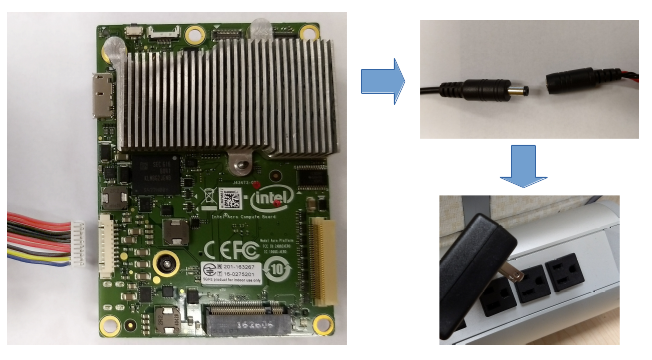

## Compute Board

The Intel Aero Compute Board is powered by its side connector with a power
supply that should meet the following specification:

| | |
|--------|-------------|
| Voltage| 5V DC       |
| Current| 3A (min 15W)|

An adapter cable with barrel connector if 5.5mm (OD) x 2.1mm (OD) is supplied
with the kit in order to connect to common power supplies available in the
market. See the diagram below for recommended connection.

For complete pinout and alternative adapter cables consult the Hardware
section.

## RTF

The RTF Kit comes with a power distribution board that's already connected to
Compute Board's power connector. It needs to be powered by connecting a LiPo
battery with the following specification:

|             |                                      |
|-------------|--------------------------------------|
| Connector   | XT60                                 |
| Cells       | 3S or 4S                             |
| Capacity    | 4000 mAh (lasts about 24min hovering)|
| Size        | 150 x 50 x 32mm (max)                |

Most LiPo batteries require a LiPo charger-balancer. Some "smart batteries"
have a cell balancer included and only require a power adapter. Make sure
they are provided with the connector above.

!!! warning
    LiPo batteries are very dense in energy and can be dangerous is not handled
    properly. If you are not already a RC Hobbyist, then working with a
    professional or joining a RC club may be a good idea.
    
    In case you plan to take your drone with you on a commercial flight be
    aware that airlines have strict rules regarding the transportation of LiPo
    batteries.
