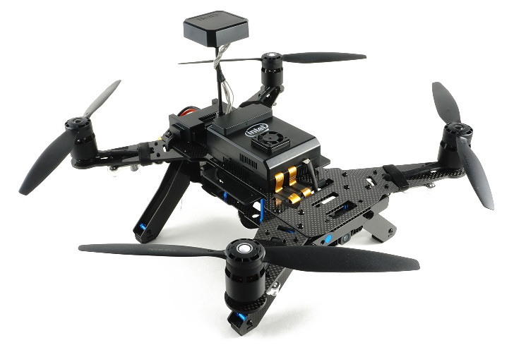

# Welcome to Intel Aero Platform

  

      
  

  

      
  

Intel Aero is a set of components to help drone developers and integrators
to have a platform to build upon. It is composed of:

  - Ready-To-Fly Kit (RTF)
  - Intel Aero Compute Board
  - Vision Accessory Kit
  - Enclosure Kit

Here you can find more information about the hardware, software and how
to use each of these components.
